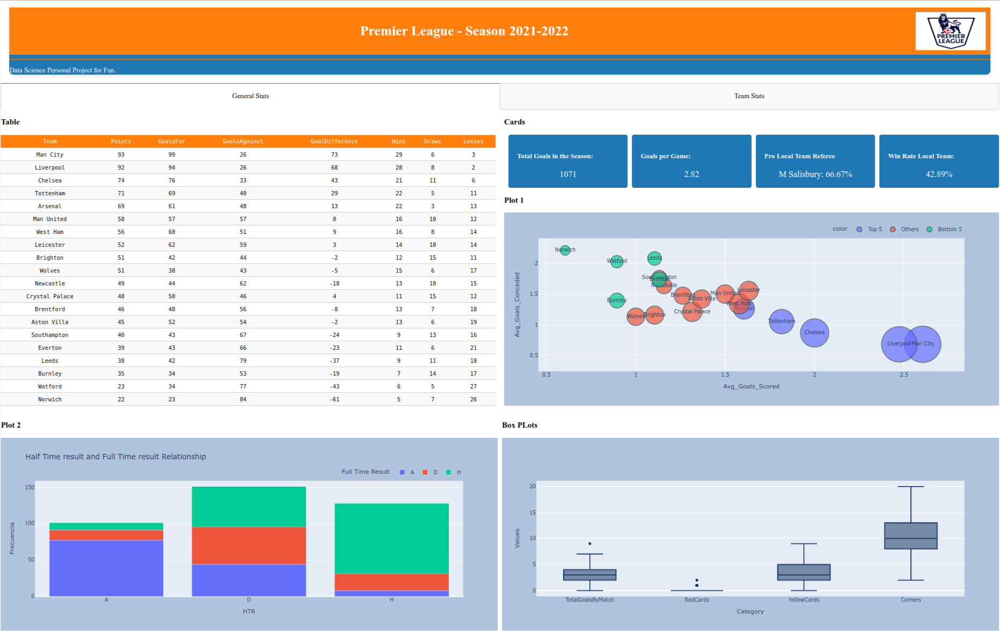

# Premier League Season Analysis

## Introduction

This project aims to analyze and transform data from the Premier League 2021-2022 season using Python, Pandas, and SQLite3. The goal is to generate insights and prepare the data for building a dashboard with basic statistics.

## Reference
For reference, you can check the official Premier League table for the 2021-2022 season [here](https://www.skysports.com/premier-league-table/2021).

## Files

1. **data.py**
   - Source data retrieval and database creation.
   - Reads the Premier League dataset from a CSV file.
   - Creates a SQLite database ('flights.db') and populates it with the dataset.
   - Retrieves the first 5 rows of the 'soccer' table.

2. **transformed_data_sqlite3.py**
   - Data transformation using SQL queries.
   - Calculates points for each team based on match outcomes (Win, Draw, Loss).
   - Creates a temporary table and calculates total points per team.
   - Displays the sorted points per team.

3. **transformed_data_dictionary.py**
   - Data transformation using Python dictionaries.
   - Calculates points for each team based on match outcomes (Win, Draw, Loss).
   - Displays the sorted points per team.

## Execution

### Prerequisites
- Check requirements.txt file

### Instructions
1. Clone the repository.
2. Run `data.py` to set up the database and explore the initial dataset.
3. Run `transformed_data_sqlite3.py` to perform SQL-based data transformation.
4. Run `transformed_data_dictionary.py` to perform dictionary-based data transformation.

## Next Steps

The current project is an initial step towards creating a dashboard with more in-depth statistical analysis for the Premier League season. Future enhancements may include:

- Implementing additional queries for more detailed insights.
- Utilizing visualization libraries like Matplotlib or Plotly for graphical representations.
- Developing a dashboard using frameworks like Dash or Flask for web-based interaction.

